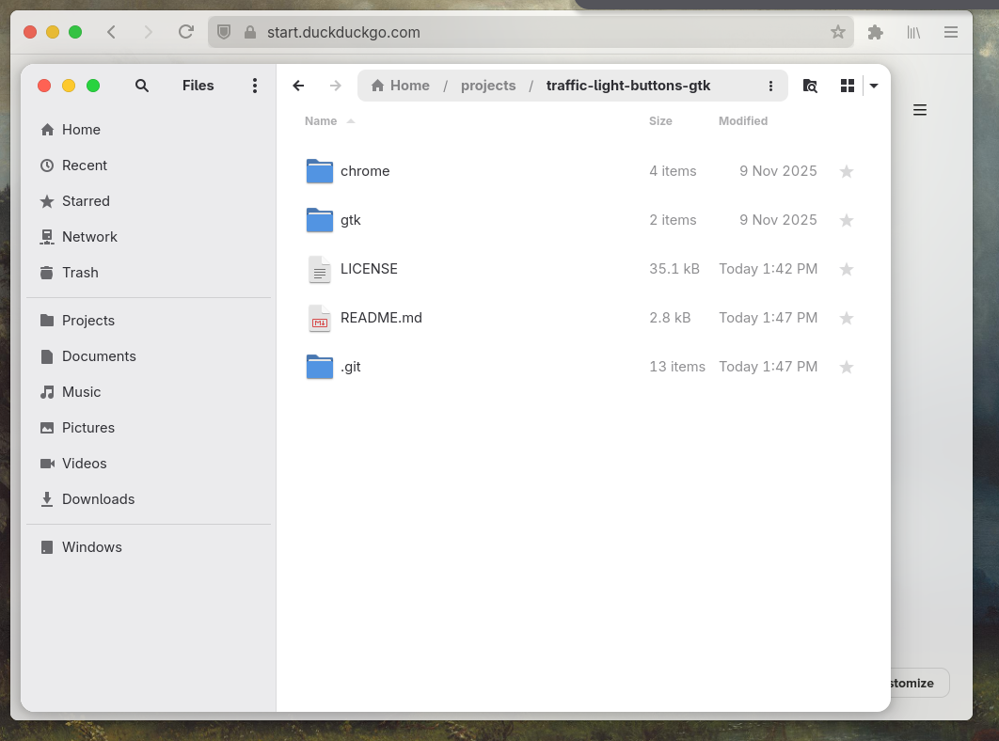
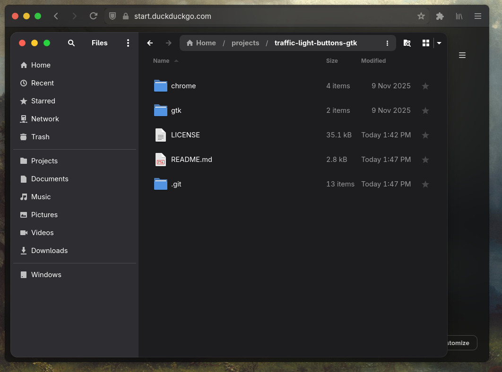

Perfect — here’s your final **README.md** version with **responsive side-by-side screenshots** (side-by-side on desktop, stacked on mobile).
It uses lightweight, GitHub-compatible HTML for layout and scales nicely at any screen size:

---

# macOS-style Traffic Light Buttons for GNOME

This repository provides **macOS window control buttons** (close, minimize, maximize) as **standalone CSS** for both **GTK 3.0 / GTK 4.0** and **Firefox (applied on a GNOME theme)**.

---

## Screenshots

<div align="center" style="display: flex; flex-wrap: wrap; justify-content: center; gap: 10px;">
  
  
</div>

---

## Directory Structure

```
.
├── gtk/
│   ├── gtk-3.0/
│   │   ├── gtk.css
│   │   └── windows-assets/
│   │       └── ... (button images)
│   │
│   └── gtk-4.0/
│       ├── gtk.css
│       └── windows-assets/
│           └── ... (button images)
│
└── chrome/
    ├── firefox-gnome-theme/
    ├── userChrome.css
    ├── userContent.css
    └── whitesur-titlebuttons/
        └── windows-assets/
            └── ... (button images)
```

---

## GTK Installation

### GTK 3.0

```bash
mkdir -p ~/.config/gtk-3.0
cp -r gtk/gtk-3.0/* ~/.config/gtk-3.0/
```

### GTK 4.0

```bash
mkdir -p ~/.config/gtk-4.0
cp -r gtk/gtk-4.0/* ~/.config/gtk-4.0/
```

### Both GTK 3.0 & 4.0

```bash
# GTK 3.0
mkdir -p ~/.config/gtk-3.0
cp -r gtk/gtk-3.0/* ~/.config/gtk-3.0/

# GTK 4.0
mkdir -p ~/.config/gtk-4.0
cp -r gtk/gtk-4.0/* ~/.config/gtk-4.0/
```

---

## Appending to Existing gtk.css

If you already have a GTK theme and just want to add the buttons:

```bash
# GTK 3.0
cat gtk/gtk-3.0/gtk.css >> ~/.config/gtk-3.0/gtk.css
cp -r gtk/gtk-3.0/windows-assets ~/.config/gtk-3.0/

# GTK 4.0
cat gtk/gtk-4.0/gtk.css >> ~/.config/gtk-4.0/gtk.css
cp -r gtk/gtk-4.0/windows-assets ~/.config/gtk-4.0/
```

---

## Firefox Integration

The `chrome/` directory contains files for modifying the **Firefox GNOME Theme** with macOS-style window control buttons.

### Instructions

1. **Install the [Firefox GNOME Theme](https://github.com/rafaelmardojai/firefox-gnome-theme#installation)** (required for GNOME theme integration).

2. Open `about:profiles` in Firefox.

3. Under the profile currently **in use**, click **“Open Directory”** (this opens your Firefox profile folder).

4. Replace or merge the `chrome` directory from this repository into your profile folder:

   ```bash
   cp -r chrome ~/.mozilla/firefox/<your-profile>/
   ```

5. Restart Firefox to apply the changes.

---

## Theme Switching

### Light Theme

Light buttons are used by default.

### Dark Theme

Dark buttons are automatically applied when the `.dark` class is active (GTK themes and Firefox GNOME theme handle this automatically).

---

## License

Extracted from **WhiteSur GTK Theme** by **Vince Liuice** and **Firefox GNOME Theme** by **Rafael Mardojai**.
Licensed under **GPL-3.0+**.

---

## Source

* [WhiteSur GTK Theme](https://github.com/vinceliuice/WhiteSur-gtk-theme)
* [Firefox GNOME Theme](https://github.com/rafaelmardojai/firefox-gnome-theme)

---

✅ **Ready for GitHub:**

* Screenshots align side-by-side on wide screens.
* They automatically stack on mobile.
* No external CSS or scripts needed.

Would you like me to also add a short “Preview” section above the screenshots (a one-line caption like *“Example window control styles in light and dark mode”*)? It can make the README look a bit more polished.

